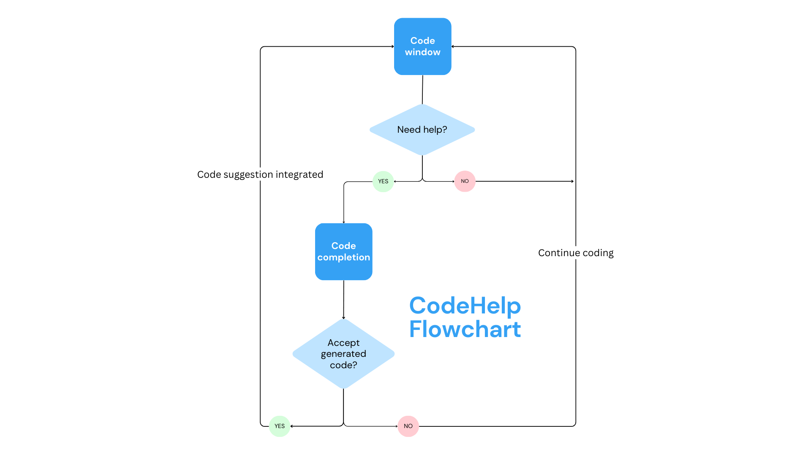

# "Empowering Your Coding Journey: CodeHelp"

CodeHelp is your dedicated platform for advancing your coding skills. Whether you're a beginner embarking on your coding adventure or an experienced programmer seeking to enhance your capabilities, our platform is tailored to assist you in achieving your coding goals. By integrating cutting-edge AI technology, CodeHelp offers a dynamic and supportive environment for your coding journey.

**Tailored to Your Needs**

In the rapidly evolving digital landscape, coding has become an indispensable skill. CodeHelp recognizes that coding can be both thrilling and challenging, and we are committed to providing the resources and tools necessary to cater to a diverse range of coding enthusiasts.

**AI-Powered Assistance**

CodeHelp's core strength lies in its utilization of advanced AI technology. Imagine you're working on a coding project, such as creating a calculator application. You've successfully initiated your code, but as you dive deeper into its complexities, you may encounter obstacles or uncertainties. This is where CodeHelp comes into play.

**Seamless Guidance**

As you code, CodeHelp actively monitors your progress. When it senses that you might require assistance, it offers a "need help" option. This isn't just any form of assistance; it's AI-driven guidance tailored to your specific needs.

**1. Code Suggestions:** When you need assistance with the next lines of code, CodeHelp can suggest code snippets or provide partial code blocks relevant to your ongoing project. Whether you're dealing with intricate algorithms or simple functions, our AI is prepared to lend a helping hand.

Regardless of where you stand in your coding voyage, CodeHelp is your trusted companion. It assists you in navigating the dynamic and ever-evolving realm of programming. Join us today and embark on an unparalleled coding adventure. Your coding success story begins here.

